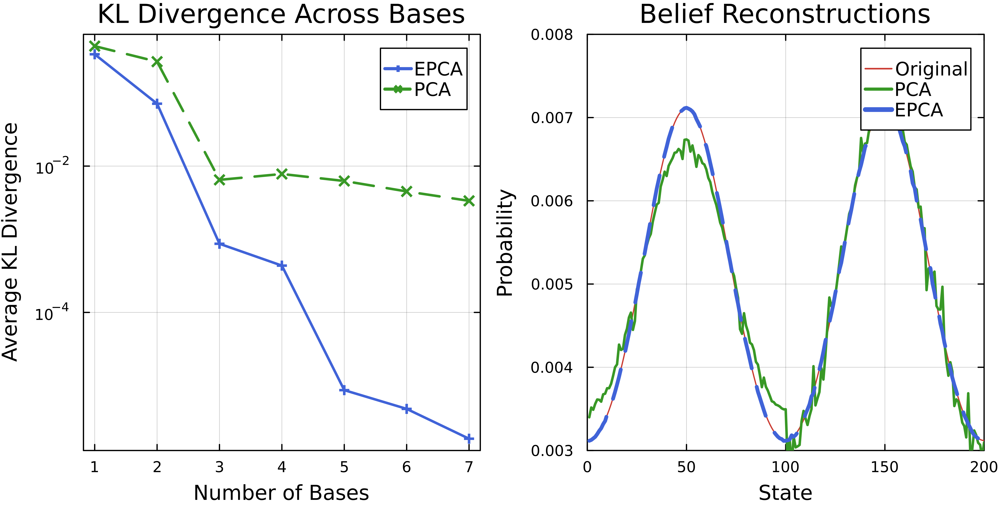

# Summary

Principal component analysis (PCA) [@PCA1; @PCA2; @PCA3] is popular for compressing, denoising, and interpreting high-dimensional data, but it underperforms on binary, count, and compositional data because the objective assumes data is normally distributed. Exponential family PCA (EPCA) [@EPCA] generalizes PCA to accommodate data from any exponential family distribution, making it more suitable for fields where these data types are common, such as geochemistry, marketing, genomics, political science, and machine learning [@composition; @elements].

`ExpFamilyPCA.jl` is a library for EPCA written in Julia, a dynamic language for scientific computing [@Julia]. It is the first EPCA package in Julia and the first in any language to support EPCA for multiple distributions.

# Statement of Need

EPCA is used in reinforcement learning [@Roy], sample debiasing [@debiasing], and compositional analysis [@gans]. Wider adoption, however, remains limited due to the lack of implementations. The only other EPCA package is written in MATLAB and supports just one distribution [@epca-MATLAB]. This is surprising, as other Bregman-based optimization techniques have been successful in areas like mass spectrometry [@spectrum], ultrasound denoising [@ultrasound], topological data analysis [@topological], and robust clustering [@clustering]. These successes suggest that EPCA holds untapped potential in signal processing and machine learning.

The absence of a general EPCA library likely stems from the limited interoperability between fast symbolic differentiation and optimization libraries in popular languages like Python and C. Julia, by contrast, uses multiple dispatch which promotes high levels of generic code reuse [@dispatch]. Multiple dispatch allows `ExpFamilyPCA.jl` to integrate fast symbolic differentiation [@symbolics], optimization [@optim], and numerically stable computation [@stable_exp] without requiring costly API conversions.[^1] As a result, `ExpFamilyPCA.jl` delivers speed, stability, and flexibility, with built-in support for most common distributions (§ [Supported Distributions](#supported-distributions)) and flexible constructors for custom distributions (§ [Custom Distributions](#supported-distributions)).

[^1]: Symbolic differentiation is essential for flexibly specifying the EPCA objective (see [documentation](https://sisl.github.io/ExpFamilyPCA.jl/v2.0/math/objectives/#2.-Using-F-and-f)). While numeric differentiation is faster, symbolic differentiation is performed only once to generate a closed form for the optimizer (e.g., `Optim.jl` [@optim]), making it more efficient in practice. @logexp (which implements ideas from @stable_exp) mitigates overflow and underflow in exponential and logarithmic operations.

## Principal Component Analysis

### Geometric Interpretation

Given a data matrix $X \in \mathbb{R}^{n \times d}$ with $n$ observations and $d$ features, PCA seeks the closest low-rank approximation $\Theta \in \mathbb{R}^{n \times d}$ by minimizing the reconstruction error

$$\begin{aligned}
& \underset{\Theta}{\text{minimize}}
& & \frac{1}{2}\|X - \Theta\|_F^2 \\
& \text{subject to}
& & \mathrm{rank}\left(\Theta\right) = k
\end{aligned}$$

where $\| \cdot \|_F$ denotes the Frobenius norm. The optimal $\Theta$ is a $k$-dimensional linear subspace that can be written as the product of the projected observations $A \in \mathbb{R}^{n \times k}$ and the basis $V \in \mathbb{R}^{k \times d}$:

$$
X \approx \Theta = AV.
$$

This suggests that each observation $x_i \in \mathrm{rows}(X)$ can be well-approximated by a linear combination of $k$ basis vectors (the rows of $V$):

$$x_i \approx \theta_i = a_i V$$

for $i = 1, \dots, n$.

### Probabilistic Interpretation

The PCA objective is equivalent to maximum likelihood estimation for a Gaussian model. Under this lens, each observation $x_i$ is a noisy realization of a $d$-dimensional Gaussian at $\theta_i \in \mathrm{rows}(\Theta)$:

$$
x_i \sim \mathcal{N}(\theta_i, I).
$$

To recover the latent structure $\Theta$, PCA solves

$$\begin{aligned}
& \underset{\Theta}{\text{maximize}}
& & \sum_{i=1}^{n}\log \mathcal{L}(x_i; \theta_i) \\
& \text{subject to}
& & \mathrm{rank}\left(\Theta\right) = k
\end{aligned}$$

where $\mathcal{L}$ is the likelihood function.

## Exponential Family PCA

### Exponential Family

Following @forster, we define the exponential family as the set of distributions with densities of the form

$$
p_\theta(x) = \exp(\theta \cdot x - G(\theta))
$$

where $\theta$ is the natural parameter and $G$ is the log-partition function.

### Link Function

The link function $g(\theta)$ connects the natural parameter $\theta$ to the mean parameter $\mu$ of an exponential family distribution. It is defined as the gradient of the log-partition function $G(\theta)$:

$$
\mu = g(\theta) = \nabla G(\theta).
$$

The link function serves a role analogous to that in generalized linear models (GLMs) [@GLM]. In GLMs, the link function connects the linear predictor to the mean of the distribution, enabling flexibility in modeling various data types. Similarly, in EPCA, the link function maps the low-dimensional latent variables to the expectation parameters of the exponential family, thereby generalizing the linear assumptions of traditional PCA to accommodate diverse distributions (see [appendix](https://sisl.github.io/ExpFamilyPCA.jl/v2.0/math/appendix/gaussian/)).

### Bregman Divergences

EPCA extends the probabilistic interpretation of PCA using a measure of statistical difference called the Bregman divergence [@Bregman; @Brad]. The Bregman divergence $B_F$ for a strictly convex, continuously differentiable function $F$ is

$$
B_F(p \| q) = F(p) - F(q) - \langle \nabla F(q), p - q \rangle.
$$

This can be interpreted as the difference between $F(p)$ and its linear approximation about $q$. When $F$ is the convex conjugate of the log-partition function of an exponential family distribution, minimizing the Bregman divergence corresponds to maximizing the associated log-likelihood [@azoury; @forster] (see [documentation](https://sisl.github.io/ExpFamilyPCA.jl/v2.0/math/bregman/)).

### Loss Function

EPCA generalizes the PCA objective as a Bregman divergence between the data $X$ and the expectation parameters $g(\Theta)$:

$$\begin{aligned}
& \underset{\Theta}{\text{minimize}}
& & B_F(X \| g(\Theta)) \\
& \text{subject to}
& & \mathrm{rank}\left(\Theta\right) = k
\end{aligned}$$

where

* $g(\theta)$ is the **link function** and the gradient of $G$,
* $G(\theta)$ is a strictly convex, continuously differentiable function (usually the **log-partition** of an exponential family distribution),
* and $F(\mu)$ is the **convex conjugate** of $G$ defined by

$$
F(\mu) = \langle \mu, \theta \rangle - G(\theta).
$$

This suggests that data from the exponential family is well-approximated by expectation parameters

$$ 
x_i \approx  g(\theta_i) = g(a_i V).
$$

### Regularization

Following @EPCA, we introduce a regularization term to ensure the optimum converges

$$\begin{aligned}
& \underset{\Theta}{\text{minimize}}
& & B_F(X \| g(\Theta)) + \epsilon B_F(\mu_0 \| g(\Theta)) \\
& \text{subject to}
& & \mathrm{rank}\left(\Theta\right) = k
\end{aligned}$$

where $\epsilon > 0$ and $\mu_0 \in \mathrm{range}(g)$.[^2] 

[^2]: In practice, we allow $\epsilon \geq 0$, because special cases of EPCA like traditional PCA are well-known to converge without regularization. Similarly, we pick $\mu_0$ to simplify terms in the objective.

### Example: Poisson EPCA

The Poisson EPCA objective is the generalized Kullback-Leibler (KL) divergence (see [appendix](https://sisl.github.io/ExpFamilyPCA.jl/v2.0/math/appendix/poisson/)), making Poisson EPCA ideal for compressing discrete distribution data. 

This is useful in applications like belief compression in reinforcement learning [@Roy], where high-dimensional belief states can be effectively reduced with minimal information loss. Below we recreate similar figures[^3] to @shortRoy and @Roy and observe that Poisson EPCA almost perfectly reconstructs a $41$-dimensional belief distribution using just $5$ basis components. For a larger environment with $200$ states, PCA struggles even with $10$ basis components.



[^3]: See Figure 3(a) in @shortRoy and Figure 12(c) in @Roy.

# API 

## Supported Distributions

`ExpFamilyPCA.jl` includes efficient EPCA implementations for several exponential family distributions.

| Julia                     | Description                                            |
|---------------------------|--------------------------------------------------------|
| `BernoulliEPCA` | For binary data                                        |
| `BinomialEPCA` | For count data with a fixed number of trials           |
| `ContinuousBernoulliEPCA` | For modeling probabilities between $0$ and $1$         |
| `GammaEPCA` | For positive continuous data                           |
| `GaussianEPCA` | Standard PCA for real-valued data                      |
| `NegativeBinomialEPCA` | For over-dispersed count data                          |
| `ParetoEPCA` | For modeling heavy-tailed distributions                |
| `PoissonEPCA` | For count and discrete distribution data               |
| `WeibullEPCA` | For modeling life data and survival analysis           |

## Custom Distributions

When working with custom distributions, certain specifications are often more convenient and computationally efficient than others. For example, inducing the gamma EPCA objective from the log-partition $G(\theta) = -\log(-\theta)$ and its derivative $g(\theta) = -1/\theta$ is much simpler than implementing the full the Itakura-Saito distance [@ItakuraSaito] (see [appendix](https://sisl.github.io/ExpFamilyPCA.jl/v2.0/math/appendix/gamma/)):

$$
D(P(\omega), \hat{P}(\omega)) =\frac{1}{2\pi} \int_{-\pi}^{\pi} \Bigg[ \frac{P(\omega)}{\hat{P}(\omega)} - \log \frac{P(\omega)}{\hat{P}{\omega}} - 1\Bigg] \, d\omega.
$$

In `ExpFamilyPCA.jl`, we would write:

```julia
G(θ) = -log(-θ)
g(θ) = -1 / θ
gamma_epca = EPCA(indim, outdim, G, g, Val((:G, :g)); options = NegativeDomain())
```

A lengthier discussion of the `EPCA` constructors and math is provided in the [documentation](https://sisl.github.io/ExpFamilyPCA.jl/v2.0/math/objectives/).

## Usage

Each `EPCA` object supports a three-method interface: `fit!`, `compress`, and `decompress`. `fit!` trains the model and returns the compressed training data; `compress` returns compressed input; and `decompress` reconstructs the original data from the compressed representation.

```julia
X = sample_from_gamma(n1, indim)  # matrix of gamma-distributed data
Y = sample_from_gamma(n2, indim)

X_compressed = fit!(gamma_epca, X)
Y_compressed = compress(gamma_epca, Y)
Y_reconstructed = decompress(gamma_epca, Y_compressed)
```

# Acknowledgments

We thank Ryan Tibshirani, Arec Jamgochian, Robert Moss, and Dylan Asmar for their help and guidance.

# References