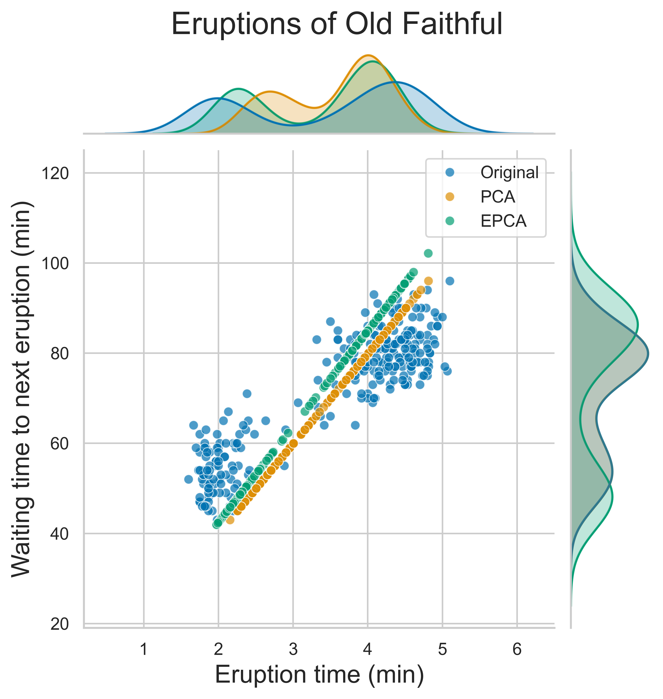
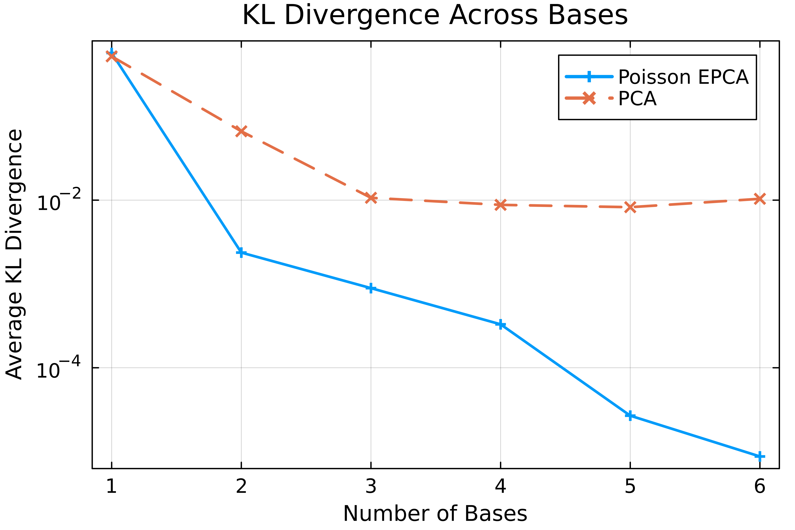
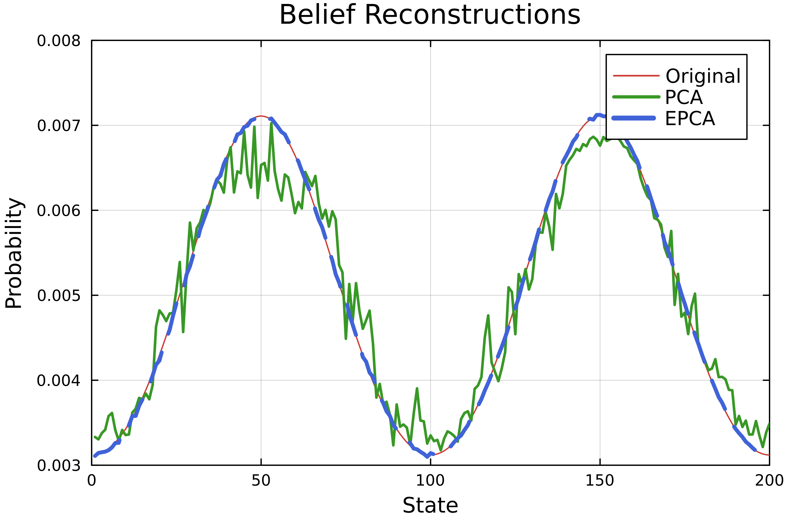

# Summary

Principal component analysis (PCA) [@PCA1; @PCA2; @PCA3] is popular for compressing, denoising, and interpreting high-dimensional data, but it can underperform on binary, count, and composition data because the model assumes data is normally distributed. Exponential family PCA (EPCA) [@EPCA] extends PCA to handle any exponential family distribution, making it more suitable for fields where these data types are common, such as geochemistry, marketing, genomics, political science, and machine learning [@composition; @elements].

`ExpFamilyPCA.jl` is a library for EPCA written in Julia, a dynamic language for scientific computing [@Julia]. It is the first EPCA package in Julia and the first in any language to support EPCA for multiple distributions.

# Statement of Need

EPCA has been applied in reinforcement learning [@Roy] and more recently in sample debiasing [@debiasing] and finance [@finance]. Wider adoption, however, remains limited due to the lack of implementations, with the only existing package supporting a single distribution in MATLAB [@epca-MATLAB]. This is surprising, as other Bregman-based optimization techniques have been successful in areas like mass spectrometry [@spectrum], ultrasound denoising [@ultrasound], topological data analysis [@topological], and robust clustering [@clustering]. These successes indicate that EPCA holds untapped potential in signal processing and machine learning.

The lack of a general EPCA library is likely due to engineering challenges. In widely used languages like Python and C, fast symbolic differentiation and optimization libraries are not typically interoperable. Julia, by contrast, uses multiple dispatch which promotes high levels of generic code reuse [@dispatch]. Multiple dispatch allows `ExpFamilyPCA.jl` to integrate fast symbolic differentiation [@symbolics], optimization [@optim], and numerically stable computation [@stable_exp] without requiring costly API conversions. As a result, `ExpFamilyPCA.jl` delivers speed, stability, and flexibility, with built-in support for most common distributions (§ [Supported Distributions](#supported-distributions)) and flexible constructors for custom distributions (§ [Custom Distributions](#supported-distributions)).

## Principal Component Analysis

### Geometric Interpretation

Given a data matrix $X \in \mathbb{R}^{n \times d}$ with $n$ observations and $d$ features, PCA seeks the closest low-rank approximation $\Theta \in \mathbb{R}^{n \times d}$ by minimizing the reconstruction error

$$\begin{aligned}
& \underset{\Theta}{\text{minimize}}
& & \frac{1}{2}\|X - \Theta\|_F^2 \\
& \text{subject to}
& & \mathrm{rank}\left(\Theta\right) = k
\end{aligned}$$

where $\| \cdot \|_F$ denotes the Frobenius norm. The optimal $\Theta$ is a $k$-dimensional linear subspace that can be decomposed as the product of the compressed observations $A \in \mathbb{R}^{n \times k}$ and the basis $V \in \mathbb{R}^{k \times d}$:

$$
X \approx \Theta = AV.
$$

This suggests that each observation $x_i \in \mathrm{rows}(X)$ can be well-approximated by a linear combination of $k$ basis vectors (the rows of $V$):

$$
x_i \approx \theta_i = a_i V
$$

for $i = 1, \dots, n$.

### Probabilistic Interpretation

The PCA objective is equivalent to maximum likelihood estimation for a Gaussian model. Under this lens, each observation $x_i$ is a noisy observation of a latent, low-rank structure $\theta_i$ corrupted with high-dimensional Gaussian noise

$$
x_i \sim \mathcal{N}(\theta_i, I).
$$

To recover the structure $\Theta$, PCA solves

$$\begin{aligned}
& \underset{\Theta}{\text{maximize}}
& & \sum_{i=1}^{n}\log \mathcal{L}(x_i; \theta_i) \\
& \text{subject to}
& & \mathrm{rank}\left(\Theta\right) = k
\end{aligned}$$

where $\mathcal{L}$ is the likelihood function.

## Exponential Family PCA

### Bregman Divergences

Bregman divergences [@Bregman; @Brad] are a measure of statistical difference that we can use to generalize the probablistic PCA objective to the exponential family. The Bregman divergence $B_F$ for a strictly convex, continuously differentiable function $F$ is

$$
B_F(p \| q) = F(p) - F(q) - \langle \nabla F(q), p - q \rangle.
$$

This can be interpreted as the difference between $F(p)$ and its linear approximation about $q$. When $F$ is taken to be the convex conjugate of the log-partition of an exponential family distribution, minimizing the Bregman divergence is the same as maximizing the corresponding log-likelihood [@azoury; @forster] (see [documentation](https://sisl.github.io/ExpFamilyPCA.jl/dev/math/bregman/)). Since the Gaussian distribution is in the exponential family, this means that Bregman divergences generalize the PCA objective.

### Parameter Duality


## Exponential Family Principal Component Analysis

EPCA generalizes the PCA objective as a Bregman divergence:

$$\begin{aligned}
& \underset{\Theta}{\text{minimize}}
& & B_F(X \| g(\Theta)) \\
& \text{subject to}
& & \mathrm{rank}\left(\Theta\right) = k
\end{aligned}$$

where

* $g(\theta)$ is the **link function** and the gradient of $G$,
* $G(\theta)$ is an arbitrary convex, differentiable function (usually the **log-parition** of an exponential family distribution),
* and $F(\mu)$ is the **convex conjugate** of $G$.

In this formulation, the data matrix $X$ is approximated by expectation parameters $g(\Theta)$. Similar to how linear regression is a special case of generalized linear models [@GLM], PCA is a special case of EPCA when the data is Gaussian (see [appendix](https://sisl.github.io/ExpFamilyPCA.jl/dev/math/appendix/gaussian/)). By selecting the appropriate function $G$, EPCA can handle a wider range of data types, offering more versatility than PCA.

Then $\theta_i = g(a_i V)$ and 

$$
a_i \in \argmin_{a \in \mathrm{R}^k}(x_i \| g(aV)).
$$

### Regularization

The optimum may diverge, so we introduce a regularization term

$$\begin{aligned}
& \underset{\Theta}{\text{minimize}}
& & B_F(X \| g(\Theta)) + \epsilon B_F(\mu_0 \| g(\Theta)) \\
& \text{subject to}
& & \mathrm{rank}\left(\Theta\right) = k
\end{aligned}$$

where $\epsilon > 0$ and $\mu_0 \in \mathrm{range}(g)$ to ensure the solution is stationary.


### Example: Gamma EPCA 

old faithful stuff here



### Example: Poisson EPCA

The Poisson EPCA objective is the generalized Kullback-Leibler (KL) divergence (see [appendix](https://sisl.github.io/ExpFamilyPCA.jl/dev/math/appendix/poisson/)), making Poisson EPCA ideal for compressing discrete distribution data. 

Add some blurb about how Poisson EPCA is then an alternative to correspondance analysis. 

This is useful in applications like belief compression in reinforcement learning [@Roy], where high-dimensional belief states can be effectively reduced with minimal information loss. Below we recreate a figure from @shortRoy and observe that Poisson EPCA achieved a nearly perfect reconstruction of a $41$-dimensional belief profile using just $5$ basis components.



For a larger environment with $200$ states, PCA struggles even with $10$ basis.



# API 

## Supported Distributions

`ExpFamilyPCA.jl` includes efficient EPCA implementations for several exponential family distributions.

| Julia                     | Description                                            |
|---------------------------|--------------------------------------------------------|
| `BernoulliEPCA` | For binary data                                        |
| `BinomialEPCA` | For count data with a fixed number of trials           |
| `ContinuousBernoulliEPCA` | For modeling probabilities between $0$ and $1$         |
| `GammaEPCA` | For positive continuous data                           |
| `GaussianEPCA` | Standard PCA for real-valued data                      |
| `NegativeBinomialEPCA` | For over-dispersed count data                          |
| `ParetoEPCA` | For modeling heavy-tailed distributions                |
| `PoissonEPCA` | For count and discrete distribution data               |
| `WeibullEPCA` | For modeling life data and survival analysis           |

## Custom Distributions

When working with custom distributions, certain specifications are often more convenient and computationally efficient than others. For example, inducing the gamma EPCA objective from the log-partition $G(\theta) = -\log(-\theta)$ and its derivative $g(\theta) = -1/\theta$ is much simpler than implementing the full the Itakura-Saito distance [@ItakuraSaito] (see [appendix](https://sisl.github.io/ExpFamilyPCA.jl/dev/math/appendix/gamma/)):

$$
D(P(\omega), \hat{P}(\omega)) =\frac{1}{2\pi} \int_{-\pi}^{\pi} \Bigg[ \frac{P(\omega)}{\hat{P}(\omega)} - \log \frac{P(\omega)}{\hat{P}{\omega}} - 1\Bigg] \, d\omega.
$$

In `ExpFamilyPCA.jl`, we would write:

```julia
G(θ) = -log(-θ)
g(θ) = -1 / θ
gamma_epca = EPCA(indim, outdim, G, g, Val((:G, :g)); options = NegativeDomain())
```

A lengthier discussion of the `EPCA` constructors and math is provided in the [documentation](https://sisl.github.io/ExpFamilyPCA.jl/dev/math/objectives/).

## Usage

Each `EPCA` object supports a three-method interface: `fit!`, `compress`, and `decompress`. `fit!` trains the model and returns the compressed training data; `compress` returns compressed input; and `decompress` reconstructs the original data from the compressed representation.

```julia
X = sample_from_gamma(n1, indim)
Y = sample_from_gamma(n2, indim)

X_compressed = fit!(gamma_epca, X)
Y_compressed = compress(gamma_epca, Y)
Y_reconstructed = decompress(gamma_epca, Y_compressed)
```

# Acknowledgments

We thank Ryan Tibshirani, Arec Jamgochian, Robert Moss, and Dylan Asmar for their help and guidance.

# References